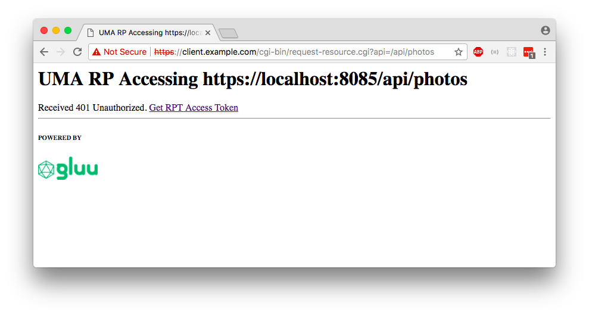

# Demo CGI

The goal of this demo is to show oxd-python at work with a minimal
amount of application overhead. A cookie is used to track a session id,
which is persisted using the python shelve database interface.

## Table of Contents

* [Scripts in cgi-bin folder](#scripts-in-cgi-bin-folder)
* [Deployment Instructions (Ubuntu 14/16)](#deployment-instructions-ubuntu-14-16)
    - [Install oxd](#install-oxd)
    - [Install Python Dependencies](#install-python-dependencies)
    - [Install and Configure Apache 2](#install-and-configure-apache-2)
    - [Install Demo](#install-demo)
    - [Setup demo UMA Resource Server](#setup-demo-uma-resource-server)
* [Demo](#demo)
    - [OpenID Connect](#openid-connect)
    - [UMA Requesting Party](#uma-requesting-party)
* [Troubleshooting](#troubleshooting)
* [Uninstall Demo](#uninstall-demo)


## Scripts in cgi-bin folder

*Properties*
* **constants.py** General Application properties: _Check paths, hostnames and ports_

*Helper scripts to install / uninstall*
* **setupDemo.py** Helper script used to create app folder and install cgi scripts.
* **cleanupDemo.py** Removes app folder and cgi-bin scripts.

*OpenID Connect demo*
* **home.cgi** This is the main page of the app. Navigate to this page
first.
* **redirect-to-login.cgi** This script gets the right authorization url from
oxd, and redirects the user's browser there for authentication / authorization.
* **callback-login.cgi** Script that runs post-authorization. The script
gets the `code` and `state` and requests tokens and user_info from oxd.
* **redirect-to-logout.cgi** Script that gets the right logout url from oxd,
and redirects the user's browser there for OpenID Connect front channel logout.
* **callback-logout.cgi** This page is called by OpenID Connect
front channel logout. It clears the session and cookie, and redirects
to the logout confirmation page
* **logout-confirmation.cgi** This pages checks to make sure that the
cookie and DB session are removed.
file permissions.

*UMA demo*
* **uma_rs** Folder contains a Flask app that runs on port localhost:8085
* **uma-home.cgi** Script that lists the resource endpoints in the UMA Resource
Server
* **request-resource.cgi** Script that requests data from UMA Resource Server
* **get-rpt.cgi** Script that gets the RPT token from the Auth Server
* **callback-claims.cgi** The script parses the response from Authorization
Server if claims gathering was necessary.

*Helper modules*
* **appLog.py** Module to centralize logging code
* **common.py** Place to put some shared methods

## Deployment Instructions

###  oxd service

Make sure `oxd-server` is running `# service oxd-server status`
or that an oxd https service is available on the network.

If necessary, install [oxd-server](https://gluu.org/docs/oxd/).

### Install python dependencies

```
# apt install python-pip
# pip install flask pyOpenSSL
```

Install the bleeding-edge `oxd-python` package from GitHub.

```
pip install git+git://github.com/GluuFederation/oxd-python.git#egg=oxdpython
```

### Install and configure Apache 2

Following are instructions for Debian/Ubuntu. For Redhat/Centos,
configure ssl and check the `cgi-bin` location, which you may
have to update in `constants.py`.

```
# apt install apache2
# a2enmod cgi
# a2enmod ssl
# a2dissite 000-default
# a2ensite default-ssl
# service apache2 restart
```

### Install demo

1. `$ git clone https://github.com/GluuFederation/oxd-python-demo-app.git`
1. `$ cd oxd-python-demo-app/cgi-bin`
1.  Update the value for `COOKIE_DOMAIN` in `constants.py`, and any other system
properties to suit your preference.
1. `$ sudo python setupDemo.py`

### Start the UMA Resource Server

This server publishes sample api's which return static data. You can use
the properties file to define which api's are available, and what scopes
are required for access.

```
$ cd ../uma_rs
$ nohup python app.py > uma_rs.log 2>&1 &
$ curl -k https://localhost:8085/api/
```

The `curl` command should return a JSON document listing the available api's.

## Demo

### OpenID Connect

Start the demo by navigating to `https://(your-hostname)/cgi-bin/home.cgi`


### UMA Requesting Party

To test UMA, visit `https://your-hostname/cgi-bin/uma-home.cgi`





## Troubleshooting

* Make sure that the web server can be reached by your local browser. You should
also make sure that the server that is running the cgi scripts can reach the
hostname of the Gluu Server (i.e. use DNS or update your `/etc/hosts` file).

* To debug, check the application log, which defaults to
`/var/log/samleapp/app.log`, and the oxd log in `/var/log/oxd-server.log`

* You should be able to login using an existing account on your Gluu Server.


## Uninstall demo

```
$ cd oxd-python-demo-app/cgi-bin
$ sudo python cleanupDemo.py
```
